# ClaudeAutoResponder - Class Diagram & Interaction Analysis

**File Output:** `./ai-docs-repo-analysis/ClaudeAutoResponder-class-diagram.md`

This analysis provides a comprehensive understanding of the ClaudeAutoResponder system structure, component relationships, and interaction patterns through visual class diagrams and architectural analysis.

---

## 🎯 **Analysis Objectives**

**Primary Goals:**
- Visualize class relationships and dependencies in the auto-responder system
- Understand component responsibilities and interactions for Claude Code prompt handling
- Identify key behavioral patterns for terminal monitoring and keystroke automation
- Create mental model of system architecture for macOS terminal automation

**Observable Elements:**
- Core classes for auto-response orchestration and terminal detection
- Configuration management and data models for prompt handling
- Platform-specific implementations for macOS integration
- Multi-threaded monitoring and sleep detection patterns

---

## 🔍 **Phase 1: Core Component Discovery**

### **Step 1.1: Observable Class Structure**

**Core Classes Identified:**

#### **AutoResponder** (responder.py:22) - Main Orchestrator
```python
class AutoResponder:
    """Main auto responder class"""
    
    def __init__(self, config: Config, debug: bool = False, monitor_all: bool = False):
        self.config = config
        self.parser = PromptParser(config.whitelisted_tools)
        self.detector = TerminalDetector()
        self.keystroke_sender = MacOSKeystrokeSender(debug)
        self.sleep_detector = SleepDetector()
        # ... state management fields
    
    def start_monitoring(self):
        """Start monitoring for Claude prompts"""
        
    def _monitoring_cycle(self):
        """Single monitoring cycle - check terminals and handle countdown"""
        
    def _handle_claude_prompt(self, prompt: ClaudePrompt):
        """Handle detected Claude prompt - start countdown"""
```

**Component Responsibility Analysis:**
- **AutoResponder**: Main coordinator, lifecycle management, monitoring orchestration
- **PromptParser**: Text analysis and Claude prompt detection logic
- **TerminalDetector**: Platform-specific terminal window access and text extraction
- **MacOSKeystrokeSender**: Keyboard automation and response sending

#### **PromptParser** (parser.py:10) - Claude Prompt Detection
```python
class PromptParser:
    """Parses terminal text to detect Claude prompts"""
    
    def __init__(self, whitelisted_tools: List[str]):
        self.whitelisted_tools = whitelisted_tools
        # Regex patterns for box detection
        self.box_top_pattern = re.compile(r'^\s*╭─+╮', re.MULTILINE)
        self.do_you_want_pattern = re.compile(r'Do\s+you\s+want', re.IGNORECASE)
        
    def parse_prompt(self, text: str, debug: bool = False) -> ClaudePrompt:
        """Parse text to detect valid Claude prompt"""
        
    def _extract_claude_boxes(self, text: str) -> List[str]:
        """Extract complete Claude Code box structures"""
```

**Parser Responsibility Analysis:**
- **Box Structure Detection**: Uses regex patterns to identify Claude Code UI boxes
- **Tool Validation**: Ensures prompts contain whitelisted tools only
- **Prompt Completeness**: Validates full prompt structure before acceptance

#### **TerminalDetector** (terminal.py:8) - macOS Terminal Integration
```python
class TerminalDetector:
    """Terminal detector using subprocess to eliminate memory leaks"""
    
    TERMINAL_BUNDLE_IDS = {
        'com.apple.Terminal', 'com.googlecode.iterm2', 
        'dev.warp.Warp-Stable', 'co.zeit.hyper'
        # ... other terminal apps
    }
    
    def _run_applescript(self, script: str, timeout: float = 5.0) -> Optional[str]:
        """Run AppleScript in subprocess for memory safety"""
        
    def get_window_text(max_lines: int = 1000) -> Optional[str]:
        """Get text from currently focused terminal window"""
        
    def get_all_terminal_windows(debug: bool = False) -> List[Dict[str, Any]]:
        """Get all open terminal windows with information"""
```

**Terminal Detector Analysis:**
- **Multi-Terminal Support**: Handles Terminal.app, iTerm2, Warp, and other popular terminals
- **Memory Management**: Uses subprocess-based AppleScript execution to prevent leaks
- **Window Management**: Focus switching, text extraction, multi-window monitoring

### **Step 1.2: Observable Configuration and Data Models**

#### **Config** (settings.py:8) - Configuration Management
```python
@dataclass
class Config:
    """Configuration settings"""
    whitelisted_tools: List[str]
    default_timeout: float
    check_interval: float = 1.0
    enable_sleep_detection: bool = False
    
    @classmethod
    def load_whitelisted_tools(cls, tools_file: str) -> List[str]:
        """Load whitelisted tools from file"""
```

#### **ClaudePrompt** (prompt.py:8) - Data Model
```python
@dataclass
class ClaudePrompt:
    """Represents a detected Claude prompt"""
    is_valid: bool = False
    has_do_you_want: bool = False
    has_caret_on_option1: bool = False
    has_option2: bool = False
    has_box_structure: bool = False
    detected_tool: Optional[str] = None
    
    @property
    def option_to_select(self) -> str:
        """Determine which option to select"""
        return "2" if self.has_option2 else "1"
```

**Data Model Analysis:**
- **Config**: Immutable configuration with file-based tool loading
- **ClaudePrompt**: Rich data model with validation flags and decision logic
- **Simple Structure**: Clean dataclasses for easy testing and serialization

---

## 📊 **Phase 2: Relationship Mapping**

### **Step 2.1: Observable Composition Relationships**

**Primary Composition Pattern:**
```python
# AutoResponder aggregates all major components
class AutoResponder:
    def __init__(self, config: Config, debug: bool = False, monitor_all: bool = False):
        self.config = config                                    # Configuration
        self.parser = PromptParser(config.whitelisted_tools)    # Prompt detection
        self.detector = TerminalDetector()                      # Terminal access
        self.keystroke_sender = MacOSKeystrokeSender(debug)     # Automation
        self.sleep_detector = SleepDetector()                   # System monitoring
```

**Dependency Analysis:**
- **AutoResponder depends on**: All major service components
- **Service Layer Pattern**: Each component has single responsibility
- **Dependency Injection**: Config passed to dependent components

### **Step 2.2: Observable Interface Patterns**

**Static Method Patterns:**
```python
class TerminalDetector:
    @staticmethod
    def get_frontmost_app() -> Optional[str]:
        """Get bundle ID of frontmost application"""
        
    @staticmethod
    def get_window_text(max_lines: int = 1000) -> Optional[str]:
        """Get text from currently focused terminal window"""
```

**Factory Pattern:**
```python
class Config:
    @classmethod
    def get_default(cls) -> "Config":
        """Get default configuration"""
        
    @classmethod
    def load_from_file(cls, config_file: str) -> "Config":
        """Load configuration from JSON file"""
```

**Interface Analysis:**
- **Static Methods**: Pure functions for system integration
- **Factory Methods**: Multiple configuration creation strategies
- **No Abstract Interfaces**: Simple concrete implementations for macOS-specific needs

---

## 🎨 **Phase 3: Mermaid Class Diagram Generation**

### **Step 3.1: Core System Architecture Diagram**

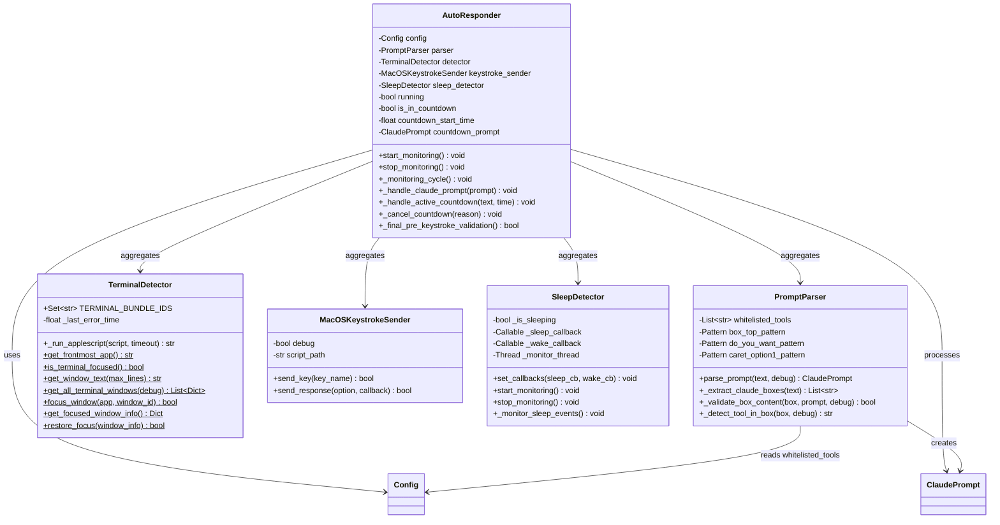

**System Architecture Explanation:**
- **AutoResponder**: Central orchestrator managing all system components
- **PromptParser**: Specialized text analysis engine for Claude prompt detection
- **TerminalDetector**: Platform abstraction layer for macOS terminal integration
- **MacOSKeystrokeSender**: Hardware abstraction for keyboard automation
- **SleepDetector**: System event monitoring for intelligent pause/resume

### **Step 3.2: Configuration and Data Model Diagram**

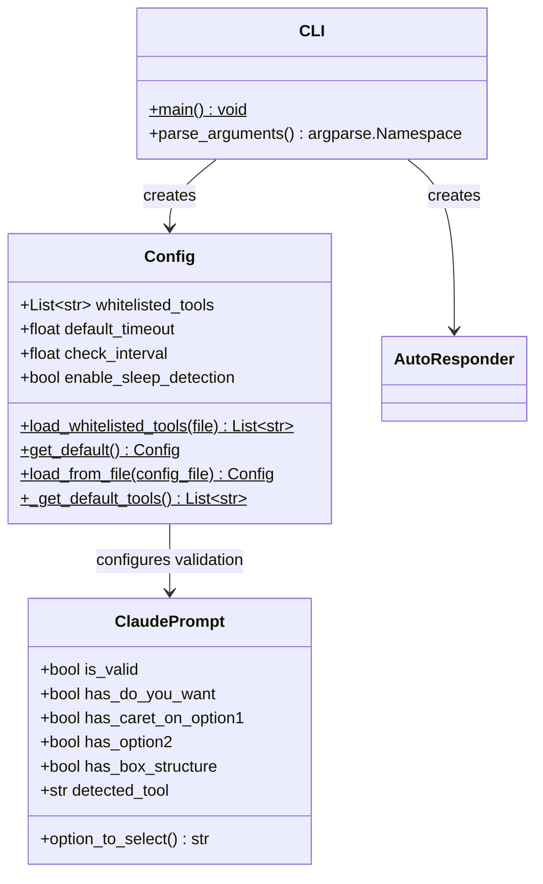

**Configuration Flow Explanation:**
- **Config**: Immutable configuration with multiple creation strategies
- **ClaudePrompt**: Rich data model with business logic for option selection
- **CLI**: Command-line interface for user interaction and configuration

### **Step 3.3: Platform Integration Diagram**

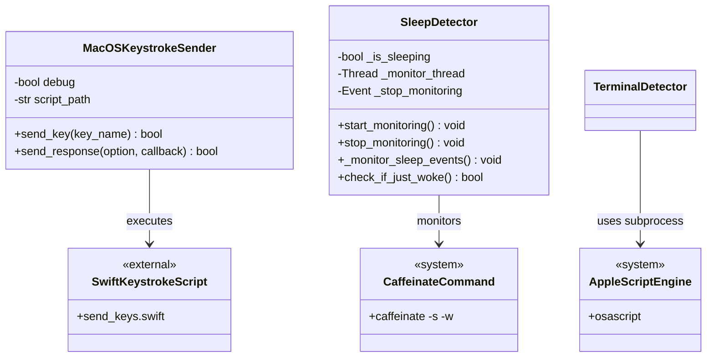

**Platform Integration Explanation:**
- **Swift Integration**: Reliable keystroke injection via external Swift script
- **AppleScript Automation**: Terminal access and window management
- **System Command Integration**: Sleep/wake detection using caffeinate

---

## 🔄 **Phase 4: Interaction Flow Analysis**

### **Step 4.1: Main Monitoring Loop Flow**

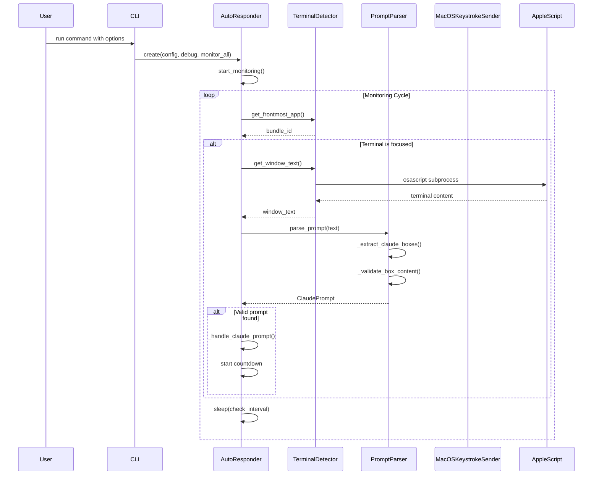

**Flow Analysis:**
- **Non-blocking Design**: Monitoring continues during countdown phases
- **Memory Management**: AppleScript runs in subprocess to prevent leaks
- **Error Recovery**: Graceful handling of terminal focus changes

### **Step 4.2: Prompt Detection and Response Flow**

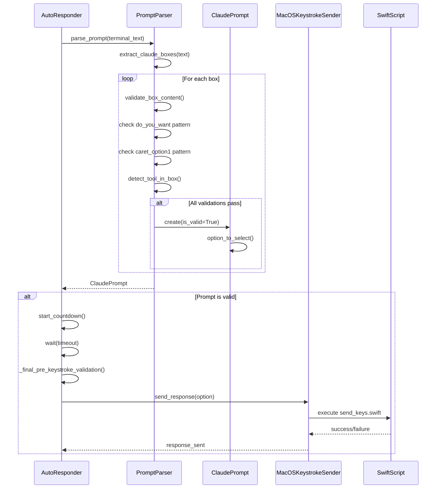

**Interaction Patterns:**
- **Multi-stage Validation**: Box structure → Content → Tool whitelist → Final validation
- **Safety Mechanisms**: Final validation right before keystroke injection
- **External Process Integration**: Swift script for reliable keyboard automation

### **Step 4.3: Multi-Window Monitoring Flow**

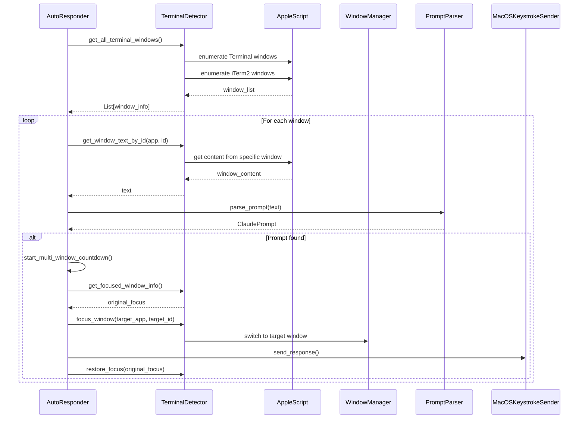

**Multi-Window Features:**
- **Window Enumeration**: Discovers all terminal windows across applications
- **Focus Management**: Saves and restores original window focus
- **Targeted Response**: Switches to correct window before sending keystrokes

---

## 🏗️ **Phase 5: Architecture Pattern Analysis**

### **Step 5.1: Observable Design Patterns**

#### **Aggregation Pattern (Service Container)**
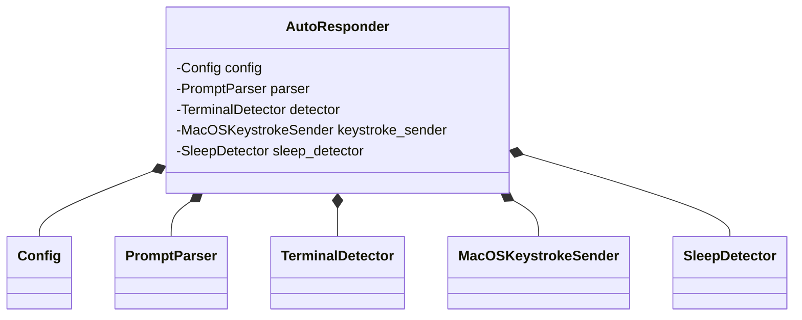

#### **State Machine Pattern**
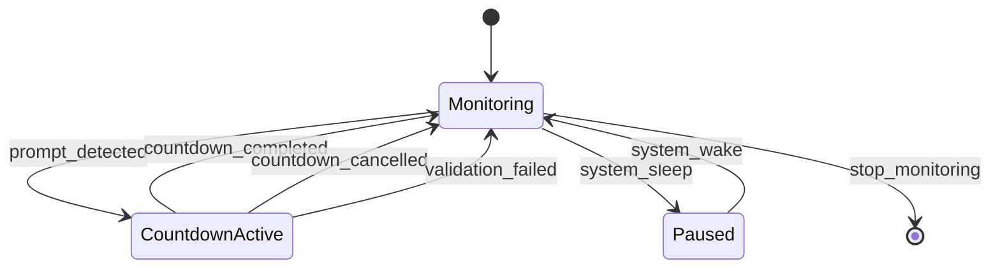

#### **Strategy Pattern (Platform Abstraction)**
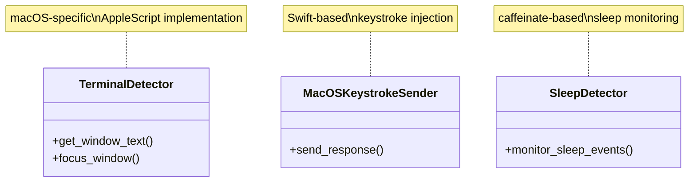

### **Step 5.2: Architecture Quality Assessment**

#### **Separation of Concerns:**
- ✅ **AutoResponder**: Orchestration and lifecycle management only
- ✅ **PromptParser**: Text analysis and validation logic only
- ✅ **TerminalDetector**: Platform-specific terminal integration only
- ✅ **Configuration**: Immutable settings with file-based loading

#### **Memory Management Strategy:**
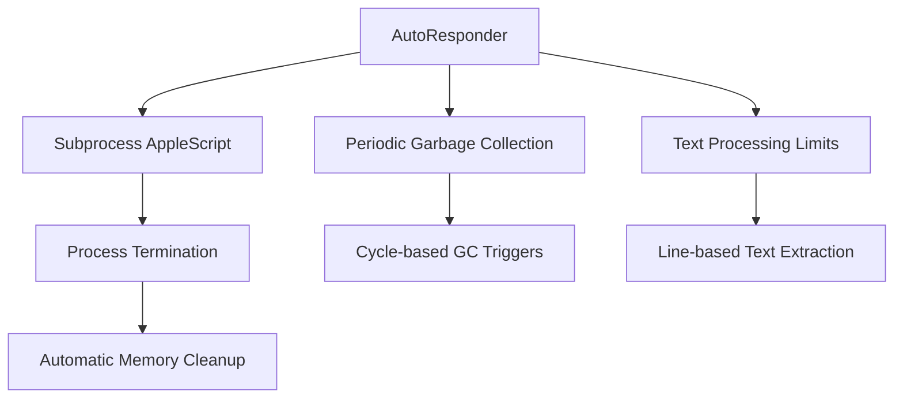

#### **Error Handling and Resilience:**
- **Graceful Degradation**: Continues monitoring when individual operations fail
- **Timeout Protection**: All external process calls have timeout limits
- **Memory Leak Prevention**: Subprocess-based AppleScript execution
- **State Recovery**: Clears stale state after system sleep/wake cycles

### **Step 5.3: Threading and Concurrency Model**

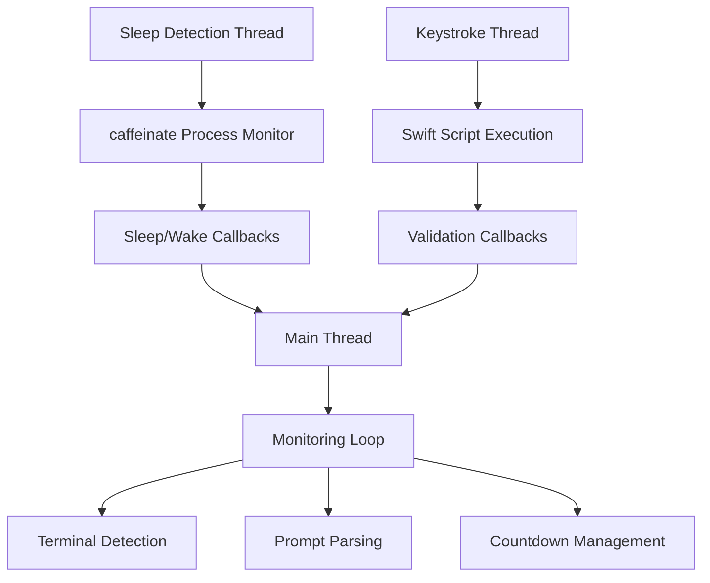

**Concurrency Analysis:**
- **Main Thread**: Handles monitoring loop and UI interactions
- **Sleep Detection Thread**: Independent system event monitoring
- **Process-based Isolation**: AppleScript and Swift execution in separate processes

---

## 📋 **Summary: System Structure Understanding**

### **Core Components Identified:**
1. **AutoResponder** - Central orchestrator with state management and lifecycle control
2. **PromptParser** - Sophisticated text analysis engine with regex-based box detection
3. **TerminalDetector** - Platform abstraction for macOS terminal integration
4. **Configuration System** - File-based configuration with immutable data structures
5. **Platform Services** - Sleep detection, keystroke automation, window management

### **Key Relationships:**
1. **Aggregation**: AutoResponder contains all major service components
2. **Data Flow**: Terminal text → Parser → Prompt model → Keystroke response
3. **Event-driven**: Sleep/wake events, countdown timers, focus changes
4. **Process Isolation**: External scripts for memory management and reliability

### **Architectural Strengths:**
- ✅ **Clear Separation of Concerns** across functional domains
- ✅ **Memory-efficient Design** with subprocess-based external tool integration
- ✅ **Multi-terminal Support** with intelligent window management
- ✅ **Robust Error Handling** with graceful degradation and recovery
- ✅ **Safety-first Approach** with multiple validation layers
- ✅ **Configuration Flexibility** with file-based and CLI-based options

### **System Capabilities:**
- **Automated Terminal Monitoring**: Detects Claude Code prompts across multiple terminal applications
- **Intelligent Response Selection**: Chooses optimal response option based on prompt analysis
- **Memory-safe Operation**: Prevents memory leaks through subprocess-based AppleScript execution
- **Multi-window Support**: Monitors all terminal windows with focus restoration
- **System Integration**: Responds to sleep/wake events for power management
- **Safety Mechanisms**: Multiple validation stages prevent incorrect responses

### **Mental Model Summary:**
The ClaudeAutoResponder implements a **sophisticated monitoring and automation system** for macOS terminal environments. The architecture follows a **service-oriented design** with the **AutoResponder as central coordinator** managing specialized components for **text analysis**, **platform integration**, and **automation**. The system demonstrates **enterprise-grade robustness** with **memory management**, **error recovery**, and **multi-threaded operation** while maintaining **safety through validation** and **user control mechanisms**. This design enables **reliable automation** of Claude Code interactions while **preserving system stability** and **user experience**.